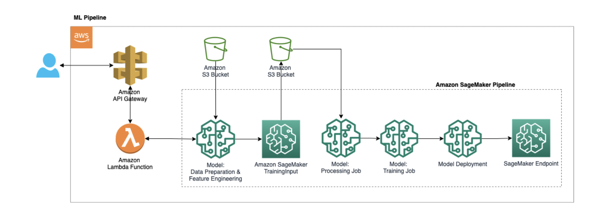

# Building Machine Learning Pipeline using AWS Sagemaker

This project is an extension of previous projects which aim to do web scraping and build a machine learning model to predict a tennis match outcome which will focus on building the e2e machine learning pipeline. AWS infrastructure will be used, inclduing AWS Sagemaker, Amazon API Gateway, Amazon Lambda Function, and Amazon S3 Bucket.

The figure below shows the overall pipeline built: 

1) Store scraped data in AWS S3 Bucket.
2) Split data into training, validation, & test set and store it in S3 Bucket.
3) Build, train, and deploy the Amazon SageMaker as an endpoint in production.
4) Create lambda function based on the endpoint.
5) Generate an API Gateway attach to the lambda function.

